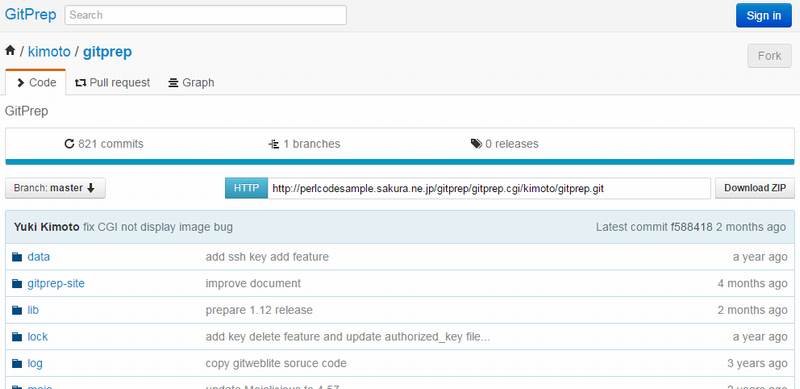

# Giblog Net version v1.12 document

Github clone. You can install portable github system into Unix/Linux.

See Giblog Net example site. [Giblog Net example site](http://perlcodesample.sakura.ne.jp/giblognet/giblognet.cgi/kimoto/giblognet)

## Features

* Github clone: Giblog Net has the same interface as GitHub.
* Portable: You can install Giblog Net on your own Unix/Linux server.
* Supports Windows installation via cygwin for Windows (need gcc4 package).
* Only needs Perl 5.8.7+.
* Smart HTTP support: you can pull and push via HTTP
* CGI support, built-in web server, and reverse proxy support.
* SSL support.

## Check Perl Version

Check Perl version. You can use Giblog Net if the Perl version is 5.8.7+;

    perl -v

### Checki git command existance

    git --version
    
## A. Installation when you run Giblog Net as CGI script

Download tar.gz archive, expand it and change directory:

    curl -kL https://github.com/yuki-kimoto/giblognet/archive/latest.tar.gz > giblognet-latest.tar.gz
    tar xf giblognet-latest.tar.gz
    mv giblognet-latest giblognet
    cd giblognet

Setup. Needed module is installed.

    ./setup.sh

If you install git in your local directry,
you must add the correct git command path to the **giblognet.conf** config file.

    [basic]
    ;;; Git command path
    git_bin=/home/yourname/local/bin/git

Check setup. Run the following command.

    prove t

If "syntax OK" is displayed, setup is sucseed.

You can access the following URL.

    http://yourhost/somepath/giblognet/giblognet.cgi

### If you see Internal Server Error

If you see an internal server error, look at the log file (giblognet/log/production.log)
to see what problem has occurred.

### Additional work when you don't run CGI script by your user.

If CGI script isn't run by your user, you need the following work.
For example, CGI script is run by apache user.

Change user and group of all files in giblognet directory to apache 

    chown -R apache:apache giblognet

In this case, you server need to execute CGI.
Check apache config file.

For example, you need the following config.

    <Directory /var/www/html>
        Options +ExecCGI
        AddHandler cgi-script .cgi
    </Directory>

## B. Installation when you run Giblog Net as embdded web server

Giblog Net has its own web server,
so you can start using the application very easily.
In this way, performance is much better than CGI.

### Create giblognet user

Create a **giblognet** user. This is not necessary, but recommended:

    useradd giblognet
    su - giblognet
    cd ~

And config global git config

    git config --global user.name "giblognet"
    git config --global user.email "giblognet@example.com"

### Download

Download tar.gz archive, expand it and change directory:

    curl -kL https://github.com/yuki-kimoto/giblognet/archive/latest.tar.gz > giblognet-latest.tar.gz
    tar xf giblognet-latest.tar.gz
    mv giblognet-latest giblognet
    cd giblognet

Setup. Needed module is installed.

    ./setup.sh

Check setup. Run the following command.

    prove t

If "syntax OK" is displayed, setup is sucseed.

### Start

You can start the application by running the provided giblognet script.
The application is run in the background and the port is **10020** by default.

    ./giblognet

Then access the following URL.

    http://localhost:10020

If you want to change the port, edit giblognet.conf.
If you cannot access this port, you might change the firewall settings.

### Stop

You can stop the application by adding the **--stop** option.

    ./giblognet --stop

## FAQ

## Can't find git command from Giblog Net

If you install git into your local directry,
you must add the correct git command path to the config file **giblognet.conf** .

    [basic]
    ;;; Git command path
    git_bin=/home/yourname/local/bin/git

### blame don't work

In Giblognet, blame page use "git blame --line-porcelain". In old git, there is no --line-porcelain option.
We don't know when --line-porcelain was added to git.
At least, blame page work well in git 1.8.2.1.

### How to upgrade Giblog Net

It is very easy. you only overwrite all files except for "giblognet.conf".

If you want to upgrade by "git pull", you can do it.
you create "giblognet.my.conf" copied from "giblognet.my.conf",
and do "git pull"

If you get a rainbow unicorn t-rex error after upgrading, you might be missing
a new CPAN dependency. Run again "setup.sh".

### I can't push large repository by http protocol

There are some reasons.

**1. Git version is old**

If you see "error: RPC failed; result=56, HTTP code = 200" , your git maybe old.
Please upgrade to latest git. I checked git version 1.8.5.5.

**2. Giblog Net restriction**

Giblog Net restrict max post message size 10MB(This is default of Mojolicious)

You maybe see the following error

    Delta compression using up to 4 threads.
    Compressing objects: 100% (17830/17830), done.
    Writing objects: 100% (18281/18281), 687.05 MiB | 129.92 MiB/s, done.
    Total 18281 (delta 295), reused 18281 (delta 295)
    error: RPC failed; result=22, HTTP code = 413
    fatal: The remote end hung up unexpectedly
    fatal: The remote end hung up unexpectedly

Please increase increase the value of MOJO_MAX_MESSAGE_SIZE
    
    # 1GB
    export MOJO_MAX_MESSAGE_SIZE=1024000000

**3. git restriction**

git restrict post max size via http protocol.
http.postBuffer value of git config is maybe small.

You maybe see the following error message.

    error: RPC failed; result=56, HTTP code = 200
    fatal: The remote end hung up unexpectedly
    Counting objects: 18281, done.
    Delta compression using up to 4 threads.
    Compressing objects: 100% (17830/17830), done.
    Writing objects: 100% (18281/18281), 687.05 MiB | 133.23 MiB/s, done.
    Total 18281 (delta 295), reused 18281 (delta 295)
    fatal: The remote end hung up unexpectedly
    Everything up-to-date

Please increase the value of http.postBuffer.
    
    # 1GB
    git config http.postBuffer 1024000000

### I can't create repository and see error message when I create repository with readme

If you see the following error message in log/production.log

    [Wed Feb 12 15:27:02 2014] [error] ... Can't execute git commit ...

you need to set User name and Email of git.
Please set user.name and user.email.

    git config --global user.name "giblognet"
    git config --global user.email "giblognet@example.com"

### How to use reverse proxy?

You can use Giblog Net via reverse proxy access

         ----------------------------     ------------
    ---->| Web Server(Reverse proxy)|---->|Giblog Net   |
    <----| (Apache, etc)            |<----|          |
         ----------------------------     ------------

I show apache config example.
You can use Name virtual host.
    
    # HTTP
    <VirtualHost *:80>

      ServerName myhost.com
      <Proxy *>
        Order deny,allow
        Allow from all
      </Proxy>
      
      ProxyRequests Off
      ProxyPreserveHost On
      ProxyPass / http://localhost:10020/ keepalive=On
      ProxyPassReverse / http://localhost:10020/
      RequestHeader set X-Forwarded-HTTPS "0"
        
    </VirtualHost>

If you use Giblog Net vis https, you should set X-Forwarded-HTTPS Request Header.

    # HTTPS
    <VirtualHost *:443>

      ServerName myhost.com
      <Proxy *>
        Order deny,allow
        Allow from all
      </Proxy>
      
      ProxyRequests Off
      ProxyPreserveHost On
      ProxyPass / http://localhost:10020/ keepalive=On
      ProxyPassReverse / http://localhost:10020/
      RequestHeader set X-Forwarded-HTTPS "1"
    </VirtualHost>

### How to use reverse proxy with sub directory?

Giblog Net support reverse proxy with sub directory.

At first, set [reverse_proxy]path_depth option.

    [reverse_proxy]

    ;;; Reverse proxy path depth (default: none)
    ;;; If proxy path is http://somehost.com/foo, you set path_depth to 1.
    ;;; If proxy path is http://somehost.com/foo/bar, you set path_depth to 2.
    path_depth=1

Next you set http server config file. The following is apache example.

    <VirtualHost *:80>
      ServerName perlcodesample.com
      <Proxy *>
        Order deny,allow
        Allow from all
      </Proxy>
      ProxyRequests Off
      ProxyPreserveHost On

      ProxyPass /app1 http://localhost:10020/app1 keepalive=On
      ProxyPassReverse /app1 http://localhost:3000/app1

      ProxyPass /app2 http://localhost:10021/app2 keepalive=On
      ProxyPassReverse /app2 http://localhost:3001/app2

      RequestHeader set X-Forwarded-HTTPS "0"
    </VirtualHost>

### How to import already existing repositories?

You can import already existing repositories by **script/import_rep** script.

    cd script
    ./import_rep -u kimoto rep_dir

**-u** is user name. rep_dir must contains git respoitories like the following.

    rep_dir/project1.git
           /project2.git
           /project3.git
           /project3.git

If **description** file exists in git repository, it is copied.

### I can't add collabortor more than one

This is Giblog Net bug before version 1.5.1.
Please use after version 1.5.2.

If you continue to use Giblog Net before version 1.5.1,
collaboration table is broken.
Please fix it by the following way.

    # Run SQLite client
    sqlite3 data/giblognet.db
    
    # drop collaboration table
    drop table collaboration;
    
    # Restart
    ./giblognet

### I want to set time zone.

OK. Giblog Net suport time zone. You can set time_zone option in conig file.

    [basic]
    ;;; Time Zone
    ;;; Giblog Net time zone is GMT by default
    ;;; You can set your local time zone.
    time_zone=+9:00

### How to hide user home directory in ssh repository URL?

**1. Use symbolic link and ssh_rep_url_base option**

At first, set [basic]ssh_rep_url_base option to /git

    ;;; SSH repository url base
    ; For exampke, If you set this value to /git, SSH repository url become
    ; ssh://kimoto@59.106.185.196/git/kimoto/giblognet.git
    ssh_rep_url_base=/git

And you create symbolic link to /home/giblognet/giblognet/data/rep
    
    cd /
    ln -s /home/giblognet/giblognet/data/rep /git
    chown giblognet:giblognet /git

**2. Use only public key authentication and set [basic]ssh_rep_url_base to empty**

If you use only public key authentication, you can access ssh repository
using the following url.

    ssh://kimoto@59.106.185.196/kimoto/giblognet.git

If you set [basic]ssh_rep_url_base to empty string, this URL is shown on Browser.

    ;;; SSH repository url base
    ; For exampke, If you set this value to /git, SSH repository url become
    ; ssh://kimoto@59.106.185.196/git/kimoto/giblognet.git
    ssh_rep_url_base=

### How to get atom feed of commits page

You can get atom feed of commits page by the following URL

    http://somehost.com/kimoto/giblognet/commits/master.atom

### How to run Giblog Net from root user

You can manage the application from the root user.

Start the application

    sudo -u giblognet /home/giblognet/giblognet/giblognet

Stop the application

    sudo -u giblognet /home/giblognet/giblognet/giblognet --stop

If you want to start the application when the OS starts,
add the start application command to **rc.local**(Linux).

If you want to make it easy to manage giblognet,
then create a run script.

    mkdir -p /webapp
    echo '#!/bin/sh' > /webapp/giblognet
    echo 'su - giblognet -c "/home/giblognet/giblognet/giblognet $*"' >> /webapp/giblognet
    chmod 755 /webapp/giblognet

You can start and stop the application with the following command.

    # Start or Restart
    /webapp/giblognet

    # Stop
    /webapp/giblognet --stop

## For Developer

If you are a developer, you can start the application in development mode.

    ./morbo

Then access the following URL.

    http://localhost:3000

If you have git, it is easy to install from git.

    git clone git://github.com/yuki-kimoto/giblognet.git

It is useful to write configuration in ***giblognet.my.conf***, not giblognet.conf.

## Web Site

[Giblog Net Web Site](http://giblognet.yukikimoto.com/)

## Internally Using Library

* [Config::Tiny](http://search.cpan.org/dist/Config-Tiny/lib/Config/Tiny.pm)
* [DBD::SQLite](http://search.cpan.org/dist/DBD-SQLite/lib/DBD/SQLite.pm)
* [DBI](http://search.cpan.org/dist/DBI/DBI.pm)
* [DBIx::Connector](http://search.cpan.org/dist/DBIx-Connector/lib/DBIx/Connector.pm)
* [DBIx::Custom](http://search.cpan.org/dist/DBIx-Custom/lib/DBIx/Custom.pm)
* [Mojolicious](http://search.cpan.org/~sri/Mojolicious/lib/Mojolicious.pm)
* [Mojolicious::Plugin::INIConfig](http://search.cpan.org/dist/Mojolicious-Plugin-INIConfig/lib/Mojolicious/Plugin/INIConfig.pm)
* [mojo-legacy](https://github.com/jamadam/mojo-legacy)
* [Object::Simple](http://search.cpan.org/dist/Object-Simple/lib/Object/Simple.pm)
* [Text::Markdown::Hoedown](http://search.cpan.org/~tokuhirom/Text-Markdown-Hoedown-1.01/lib/Text/Markdown/Hoedown.pm)
* [Validator::Custom](http://search.cpan.org/dist/Validator-Custom/lib/Validator/Custom.pm)

## Sister project

These are my Perl web application projects.

* [WebDBViewer](https://github.com/yuki-kimoto/webdbviewer) - Database viewer to see database information on web browser.

## Bug

If you find bug, plese tell me on GitHub issue. 

Please post only bug information.

* [Github Issue](https://github.com/yuki-kimoto/giblognet/issues?state=open)

## Mailing list (Asking questions and feature requests)

* [Google Giblog Net Group](https://groups.google.com/forum/#!forum/giblognet)

You can ask questions about usage of Giblog Net in this mailing list.

If you want new features, please post the request to this mailing list.

## Copyright & license

Copyright 2012-2014 Yuki Kimoto. All rights reserved.

This program is free software; you can redistribute it and/or modify it
under the same terms as Perl itself.